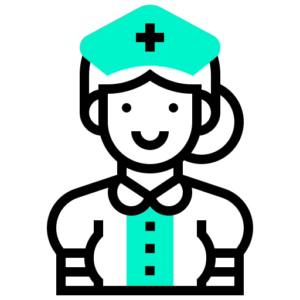

# 💕코드를 즐기다 보니 만들게 된 풀스택 포트폴리오🥳

> 웃으며 시작해서 만족스럽게 마무리 할 줄 아는 나는야~ 즐기는 개발자🎶

기본이 단단한 **코딩의 기술력**을 갖추고, **cs기반의 구조적 문제해결 능력을 겸비** 한 저는, **저만의 협업 능력**으로 *~~이기적인 팀을 제외~~* 한 어느 팀에도 도움이 될 수 있습니다. 
<br/>

---
<!--이름, 이메일, 깃허브 주소, 포트폴리오 , 2*4 테이블 만들기-->
## Contact & Links
<!---->

<p style="text-align:center"></p>


|TITLE| CONTENTS |
|-|-|
|**이름**|임민재|
|**이메일**|impaerior@daum.net|
|**깃허브**|https://github.com/remonadd21/imstack_20250825|
|**포트폴리오**|제작중|

---
## Golds

- **Git**을 이해하고, **GitHub**를 다루는 능력을 이해함

- html 뿐 아니라 **markdown**을 활용한 문서에 대한 이해도 향상

- ai기술력을 이용한 **트러블슈팅** 과
**해결방안**에 대한 능력 향상

---
## 기술스택 기반 cs역량

- Git을 사용한 로컬 기술향상
- GitHub를 활용한 클라우드 사용
- markdown을 이용한 문서 활용 능력 확장

- html을 이용한 웹표준과 템플릿 능력 업그레이드

- css와 css3의 차이와 css3의 고급 기술 능력 습득

- javascript를 이용한 DOM의 이해와 프로그램 문법에 대한 능력습득

- javascript의 라이브러리 jQuery의 기술능력 습득

- ai 프롬프트
---

## 👩‍🎓 Study Day4

```
> (오전시간)
> 마크업 CSS

> (오후시간)
1. print, println, printf 사용한 문제 풀기
2. 숫자와 문자 구분하여 계산되도록 만들기
3. 변수, 상수, 입력
```
---

## 👩‍🎓 Study Day5

```
> (오전시간)
> 복습문제
> git에서 수정사항 저장하기
> 전날 프로필 문제 풀이, 3개 짜리 프로필 만들기 마크업

> (오후시간)

> 3개 짜리 프로필 마크업 풀이
> java 자료형
> DataType class에서 자료형 설명
> Scanner (입력사용)
> Scanner 연습문제
> 추가 연습문제

```
---

## 👩‍🎓 Study Day6

```

1. git에 올려진 자료를 지정한 폴더를 만들어 복사할 수 있다.
  폴더가 스스로 만들어짐!

> git clone 주소 복사할 폴더명

2. 모든 작업을 팀원들과 master로 할 수 없기 때문에 각각의 닉네임
처름 사용 할 브런치가 필요하다.

> git branch  사용한 브런치 명
> git checkout -b 사용할 브런치명

: checkout을 해야 새로운 브런치를 사용할 수 있다.

3. 브런치 전환하기

> git switch 바꿀 기존의 브런치명


```
---

## 👩‍🎓 Study Day7

```
1. 복습 문제
2. id와 class
3. 기존의 web002_2_users.html 내부적용 css로 풀기
4. java 복습문제 풀기
5. java 실습문제 풀기 
  > 실수 입력 문제
  > 성적표 문제

6. 형 변환
  com.company.java3 패키지 만들기
  Casting class 만들기
  > 자동 형 변환과, 강제 형 변환에 대해 알아보기
```
---

## 💖포트폴리오
<!--
    1. java
    2. html + css + javascript / jQuery
-->

<br/>
<br/>
🧭 브랜드별 홈페이지 제작 시 핵심 포인트

| 브랜드        | 중요 포인트                         | 이유 및 설명 |
|---------------|--------------------------------------|--------------|
| **Audi**       | **비주얼 중심의 히어로 섹션**         | 고급스러움과 정제된 감성을 전달하기 위해, 큰 이미지와 절제된 타이포그래피가 핵심입니다. |
|               | **미니멀한 인터랙션**                | 과도한 효과보다 부드러운 페이드·패럴랙스 등으로 정제된 사용자 경험을 제공합니다. |
| **Microsoft**  | **정보 구조화와 접근성**              | 생산성과 신뢰를 강조하기 위해 명확한 정보 전달과 키보드 탐색, 포커스 스타일 등이 중요합니다. |
|               | **기능 중심의 카드 레이아웃**         | 다양한 프로젝트나 기능을 명확하게 구분해 보여주는 것이 핵심입니다. |
| **ASUS**       | **퍼포먼스 강조 섹션**                | 기술적 성능을 시각적으로 표현하는 벤치마크, 그래프, 수치 중심의 콘텐츠가 중요합니다. |
|               | **강렬한 모션과 각진 레이아웃**        | 브랜드의 테크 엣지를 시각적으로 드러내기 위한 요소입니다. |
| **Daiso**      | **가격·효용 중심의 콘텐츠 배치**       | 실용성과 가성비를 강조하기 위해 가격 배지, 추천 리스트 등 직관적인 구성 필요. |
|               | **친근한 UI와 이모지 활용**            | 사용자와의 거리감을 줄이고, 브랜드 특유의 ‘소확행’ 감성을 전달합니다. |
| **Xiaomi**     | **아이콘 기반의 기능 소개 섹션**       | 스마트하고 직관적인 제품군을 표현하기 위해 아이콘 그리드와 스텝형 콘텐츠가 효과적입니다. |
|               | **밝고 에너지 넘치는 컬러·모션**       | 젊고 혁신적인 브랜드 이미지를 강화하기 위한 시각적 요소입니다. |

---

## ✌️트러블 슈팅

### 트러블슈팅 (1)  : 2025.08.25(월)
```bash
TJ-BU-703-P03@DESKTOP-5CVIKGS MINGW64 /c/KIMYOUNGMIN/workspace (master)
$ git commit -m "git 수정 후 다시올리기"
On branch master
Changes not staged for commit:
  (use "git add <file>..." to update what will be committed)
  (use "git restore <file>..." to discard changes in working directory)       
        modified:   day001.md

no changes added to commit (use "git add" and/or "git commit -a")
```
#### 느낀점
저장하지 않았을때 어떤 문제가 생기는지, 변화가 없는 이유가 무엇인지 정확하게 할게 되었음.

---
<br/>

### 트러블슈팅 (2) : 2025.08.26(화)
```bash
TJ-BU-703-강사PC@DESKTOP-2Q95R1R MINGW64 /d/hyojung/workspace (master)
$ git pull  origin master 
remote: Enumerating objects: 5, done.
remote: Counting objects: 100% (5/5), done.
remote: Compressing objects: 100% (3/3), done.
remote: Total 3 (delta 1), reused 0 (delta 0), pack-reused 0 (from 0)     
Unpacking objects: 100% (3/3), 1.03 KiB | 15.00 KiB/s, done.
From https://github.com/sally03915/fullstack_20250825
 * branch            master     -> FETCH_HEAD
   031d931..5ac68d8  master     -> origin/master
Auto-merging day002.md
CONFLICT (content): Merge conflict in day002.md
t the result.
```
#### 느낀점
CONFLICT 라는 충돌 현상이 발생하여, master의 개념에 대해 이해하게 되었음.

---
<br/>


### 트러블슈팅 (3) : 2025.08.26(화)
```bash
TJ-BU-703-강사PC@DESKTOP-2Q95R1R MINGW64 /d/hyojung/workspace (master|MERGING) $ git pull origin master error: You have not concluded your merge (MERGE_HEAD exists). hint: Please, commit your changes before merging. fatal: Exiting because of unfinished merge.
```

#### 느낀점

pull로 자료를 불러와서
확인해야 되는 이유도 정확하게 알았음.

---

### 트러블슈팅 (4) : 2025.08.27(수)

```bash
GitHub에서 수정된 내용을 가져오지 pull로 불러오지 않아서
push 되지 않았던 문제 발생 

````

#### 느낀점

누군가가 작업한 문서나 파일이 있을지도 모르기 때문에 **반드시
pull을 사용** 해야 한다는 것을 다시한번 이해했음!

---

### 트러블슈팅 (5) : 2025.08.29(금)

```bash
PS F:\imminjae\workspace> git push origin master
To https://github.com/remonadd21/imstack_20250825.git
 ! [rejected]        master -> master (fetch first)
error: failed to push some refs to 'https://github.com/remonadd21/imstack_20250825.git'
hint: Updates were rejected because the remote contains work that you do not
hint: have locally. This is usually caused by another repository pushing to
hint: the same ref. If you want to integrate the remote changes, use
hint: 'git pull' before pushing again.
hint: See the 'Note about fast-forwards' in 'git push --help' for details.

````

#### 느낀점

1. 발생 문제 : 로컬 master와 원격 브랜치 (origin/master) 차이 발생
2. 해결방안 :

git pull.. origin master --rebase

--rebase란? 로벌변경사항을 원격변경사항에 직접 접근하여 덮어주기

git diff 

: git diff는 변경사항을 확인할 수 있음


git status

: 변경된 항목을 확인 할 수 있음

q

: q는 빠져나오기

---


<br/>
<br/>
<br/> 

---
## 📌 참고문헌
- [Git 공식 문서](https://git-scm.com/doc)  
- [Markdown 가이드](https://www.markdownguide.org/basic-syntax/)  
- [VS Code 공식 사이트](https://code.visualstudio.com/)  
- [AI 프롬프트 작성 팁](https://learn.microsoft.com/en-us/azure/ai-services/openai/how-to/prompt-engineering)