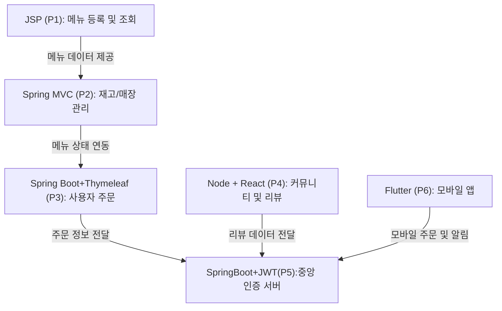

## ■ 전체 콘셉트 : 베스킨라빈스 통합 플랫폼  
> 아이스크림 메뉴 추천 + 주문 + 재고 관리 + 매장 운영 + 모바일 앱을 통합한 프랜차이즈 운영 플랫폼  
> **기술 스택**: JSP, Spring MVC, Spring Boot, Node.js, React, JWT, Redis, Flutter

---

#### 🚀 1. 기획의도  
Baskin Universe는 아이스크림 프랜차이즈 운영을 위한 통합 플랫폼입니다.  
고객에게는 맞춤형 메뉴 추천과 간편한 주문을, 관리자에게는 재고 및 매장 운영을 제공합니다.  
다양한 기술 스택을 활용해 웹/모바일/관리자 시스템을 모듈화하여 구축하였으며,  
실제 프랜차이즈 운영에 필요한 기능과 데이터 흐름을 반영했습니다.

---

#### 🚀 2. 연결 구조

---

#### 🚀 3. 프로젝트 번호 요약

| 번호 | 기술 스택 | 주요 기능 |
|------|------------|------------|
| P1 | JSP + Oracle | 아이스크림 메뉴 등록/조회 |
| P2 | Spring MVC + MyBatis + JSTL | 재고 관리, 매장 운영, 직원 관리 |
| P3 | Spring Boot + JPA + Thymeleaf | 사용자 주문, 결제, 주문 내역 |
| P4 | Node.js + React | 커뮤니티, 리뷰, 이벤트 공유 |
| P5 | Spring Boot + JWT + Redis | 중앙 인증 서버, 회원 관리, API 인증 |
| P6 | Flutter | 모바일 주문, 푸시 알림, UX 최적화 |

---

#### 🚀 4. 공통 사용자 모듈 (중앙 인증 서버 기반)

**기술 스택**: Spring Boot + JWT + Redis  
**역할**: 회원가입, 로그인, 인증/인가, 포인트 및 등급 관리

**공통 테이블**:

| 테이블명       | 설명 |
|----------------|------|
| `User`         | 사용자 정보 (user_id, email, password, grade, created_at 등) |
| `Role`         | 사용자 역할 (고객, 직원, 관리자 등) |
| `AuthToken`    | JWT 토큰 정보 (access_token, refresh_token, 만료일 등) |
| `LoginLog`     | 로그인 이력 (user_id, login_time, ip_address 등) |
| `UserPoint`    | 사용자 포인트 적립/사용 내역 |

→ 각 프로젝트는 중앙 인증 서버에서 발급된 JWT 토큰을 검증하고 사용자 정보를 기반으로 기능 수행

 
 
 
 

######  1. table (user) + sequence (user_seq)
| 컬럼명       | 데이터 타입       | 제약 조건               | 설명 |
|--------------|-------------------|--------------------------|------|
| `user_id`     | `NUMBER`          | `PRIMARY KEY`            | 사용자 고유 ID |
| `email`       | `VARCHAR2(200)`   | `NOT NULL`, `UNIQUE`     | 이메일 주소 |
| `password`    | `VARCHAR2(100)`   | `NOT NULL`               | 비밀번호 |
| `nickname`    | `VARCHAR2(100)`   | —                        | 닉네임 |
| `grade_id`    | `NUMBER`          | `FOREIGN KEY REFERENCES user_grade(grade_id)` | 사용자 등급 |
| `created_at`  | `DATE`            | `DEFAULT SYSDATE`        | 가입일 |

 
 
 

######  2. table (role) + sequence (role_seq)
| 컬럼명       | 데이터 타입       | 제약 조건        | 설명 |
|--------------|-------------------|------------------|------|
| `role_id`     | `NUMBER`          | `PRIMARY KEY`    | 역할 ID |
| `role_name`   | `VARCHAR2(50)`    | `NOT NULL`       | 역할 이름 (고객, 직원, 관리자 등) |

 
 
 

######  3. table (auth_token)
| 컬럼명           | 데이터 타입       | 제약 조건                                | 설명 |
|------------------|-------------------|------------------------------------------|------|
| `token_id`        | `NUMBER`          | `PRIMARY KEY`                            | 토큰 ID |
| `user_id`         | `NUMBER`          | `FOREIGN KEY REFERENCES user(user_id)`   | 사용자 ID |
| `access_token`    | `VARCHAR2(500)`   | `NOT NULL`                               | 액세스 토큰 |
| `refresh_token`   | `VARCHAR2(500)`   | —                                        | 리프레시 토큰 |
| `expires_at`      | `DATE`            | —                                        | 만료일 |

 
 
 

###### 4. table (login_log) + sequence (login_log_seq)
| 컬럼명        | 데이터 타입       | 제약 조건                                | 설명 |
|---------------|-------------------|------------------------------------------|------|
| `log_id`       | `NUMBER`          | `PRIMARY KEY`                            | 로그 ID |
| `user_id`      | `NUMBER`          | `FOREIGN KEY REFERENCES user(user_id)`   | 사용자 ID |
| `login_time`   | `DATE`            | `DEFAULT SYSDATE`                        | 로그인 시간 |
| `ip_address`   | `VARCHAR2(100)`   | —                                        | 접속 IP 주소 |

 
 
 

###### 5. table (user_point) + sequence (point_seq)
| 컬럼명        | 데이터 타입       | 제약 조건                                | 설명 |
|---------------|-------------------|------------------------------------------|------|
| `point_id`     | `NUMBER`          | `PRIMARY KEY`                            | 포인트 내역 ID |
| `user_id`      | `NUMBER`          | `FOREIGN KEY REFERENCES user(user_id)`   | 사용자 ID |
| `point`        | `NUMBER`          | `NOT NULL`                               | 포인트 수량 (+/-) |
| `reason`       | `VARCHAR2(300)`   | —                                        | 적립/사용 사유 |
| `created_at`   | `DATE`            | `DEFAULT SYSDATE`                        | 발생일 |

 
 
 

######  6. table (user_grade) + sequence (grade_seq)
| 컬럼명       | 데이터 타입       | 제약 조건        | 설명 |
|--------------|-------------------|------------------|------|
| `grade_id`    | `NUMBER`          | `PRIMARY KEY`    | 등급 ID |
| `grade_name`  | `VARCHAR2(50)`    | `NOT NULL`       | 등급명 (브론즈, 실버, 골드 등) |
| `benefit`     | `VARCHAR2(300)`   | —                | 등급 혜택 설명 |
 

 
 

---

#### 🚀 5. PROJECT1 - 메뉴 등록 및 조회 (JSP + Oracle)

**기능**: 아이스크림 메뉴 등록, 카테고리 관리, 기본 CRUD  
> 기초 CRUD + JSP 연습

**주요 테이블**:

| 테이블명     | 설명 |
|--------------|------|
| `Menu`       | 아이스크림 메뉴 정보 (이름, 맛, 가격, 설명 등) |
| `Category`   | 메뉴 카테고리 (예: 아이스크림, 케이크, 음료 등) |
| `MenuTag`    | 메뉴 태그 (예: 달콤함, 상큼함, 인기 등) |
| `MenuAudit`  | 메뉴 변경 이력 (변경자, 변경일, 변경 내용 등) |

**아이디어**:
1. 태그 기반 메뉴 추천: 사용자가 선택한 태그에 따라 메뉴 추천  
2. 메뉴 등록 시 자동 태깅: 키워드 기반으로 태그 자동 추천  
3. 메뉴 변경 이력 관리: 변경자, 변경일, 변경 내용 기록  
4. 인기 메뉴 통계: 조회수, 주문 수 기준으로 인기 메뉴 시각화  
5. 메뉴 비활성화 기능: 품절 시 자동 숨김 처리  

 

 
 
 

###### 1. table (menu) + sequence (menu_seq)
| 컬럼명       | 데이터 타입       | 제약 조건               | 설명 |
|--------------|-------------------|--------------------------|------|
| `menu_id`     | `NUMBER`          | `PRIMARY KEY`            | 메뉴 고유 ID |
| `name`        | `VARCHAR2(100)`   | `NOT NULL`               | 메뉴 이름 |
| `flavor`      | `VARCHAR2(100)`   | —                        | 맛 설명 |
| `price`       | `NUMBER`          | `NOT NULL`               | 가격 |
| `description` | `VARCHAR2(500)`   | —                        | 상세 설명 |
| `category_id` | `NUMBER`          | `FOREIGN KEY REFERENCES category(category_id)` | 카테고리 ID |
| `is_active`   | `CHAR(1)`         | `DEFAULT 'Y'`            | 활성 여부 (Y/N) |
| `created_at`  | `DATE`            | `DEFAULT SYSDATE`        | 등록일 |

 
 
 

######  2. table (category) + sequence (category_seq)
| 컬럼명       | 데이터 타입       | 제약 조건        | 설명 |
|--------------|-------------------|------------------|------|
| `category_id` | `NUMBER`          | `PRIMARY KEY`    | 카테고리 고유 ID |
| `name`        | `VARCHAR2(100)`   | `NOT NULL`       | 카테고리 이름 (예: 아이스크림, 케이크 등) |
| `description` | `VARCHAR2(300)`   | —                | 설명 |

 
 
 

######   3. table (menu_tag) + sequence (tag_seq)
| 컬럼명       | 데이터 타입       | 제약 조건        | 설명 |
|--------------|-------------------|------------------|------|
| `tag_id`      | `NUMBER`          | `PRIMARY KEY`    | 태그 고유 ID |
| `name`        | `VARCHAR2(100)`   | `NOT NULL`       | 태그 이름 (예: 달콤함, 상큼함 등) |
| `description` | `VARCHAR2(300)`   | —                | 설명 |

 
 
 

######   4. table (menu_tag_map)
| 컬럼명       | 데이터 타입       | 제약 조건                                                        | 설명 |
|--------------|-------------------|------------------------------------------------------------------|------|
| `menu_id`     | `NUMBER`          | `FOREIGN KEY REFERENCES menu(menu_id)`                          | 메뉴 ID |
| `tag_id`      | `NUMBER`          | `FOREIGN KEY REFERENCES menu_tag(tag_id)`                       | 태그 ID |
| **복합키**    |                   | `PRIMARY KEY (menu_id, tag_id)`                                 | 메뉴-태그 매핑 |

 
 
 

######  5. table (menu_audit) + sequence (audit_seq)
| 컬럼명        | 데이터 타입       | 제약 조건                                | 설명 |
|---------------|-------------------|------------------------------------------|------|
| `audit_id`     | `NUMBER`          | `PRIMARY KEY`                            | 변경 이력 ID |
| `menu_id`      | `NUMBER`          | `FOREIGN KEY REFERENCES menu(menu_id)`   | 대상 메뉴 ID |
| `changed_by`   | `VARCHAR2(100)`   | `NOT NULL`                               | 변경자 |
| `change_date`  | `DATE`            | `DEFAULT SYSDATE`                        | 변경일 |
| `change_note`  | `CLOB`            | —                                        | 변경 내용 |

 
 
 

---

#### 🚀 6. PROJECT2 - 재고 및 매장 관리 (Spring MVC)

**기능**: 매장별 재고 관리, 발주, 직원 관리  
> Spring MVC + MyBatis + JSTL 실습

**주요 테이블**:

| 테이블명     | 설명 |
|--------------|------|
| `Inventory`  | 재고 정보 (메뉴 ID, 수량, 입고일 등) |
| `Store`      | 매장 정보 (위치, 연락처, 운영시간 등) |
| `Staff`      | 직원 정보 (이름, 역할, 근무 매장 등) |
| `OrderSupply`| 재고 발주 요청 및 처리 내역 |
| `StoreLog`   | 매장 운영 로그 (매출, 이슈, 점검 등) |

**아이디어**:
1. 재고 임계치 알림: 재고가 일정 수량 이하일 경우 관리자에게 알림  
2. 매장별 인기 메뉴 분석: 지역별 인기 메뉴 시각화  
3. 발주 자동화: 재고 소진 속도 기반 자동 발주 제안  
4. 직원 근무 스케줄 관리: 근무 시간표 등록 및 알림  
5. 매장 운영 리포트: 일별/월별 매출, 이슈, 고객 피드백 통계 제공  

---
  
#### 🚀 7. PROJECT3 - 사용자 주문 및 결제 시스템 (Spring Boot + Thymeleaf)

**기능**: 사용자 주문, 결제, 주문 내역 조회  
> Spring Boot + JPA + Thymeleaf 기반 사용자 주문 흐름 구현

**주요 테이블**:

| 테이블명        | 설명 |
|-----------------|------|
| `Order`         | 주문 정보 (주문번호, 사용자, 주문일, 총액 등) |
| `OrderItem`     | 주문 상세 (메뉴 ID, 수량, 단가 등) |
| `Payment`       | 결제 정보 (결제수단, 결제일, 상태 등) |
| `Cart`          | 장바구니 정보 (사용자, 메뉴, 수량 등) |
| `Delivery`      | 배달 정보 (주소, 요청사항, 배달 상태 등) |

**아이디어**:
1. 장바구니 기반 주문 흐름: 장바구니에 담긴 메뉴를 주문으로 전환  
2. 결제 수단 선택 기능: 카드, 간편결제 등 다양한 결제 방식 지원  
3. 주문 상태 추적: 주문 접수 → 조리 중 → 배달 중 → 완료 상태 표시  
4. 주문 내역 필터링: 날짜, 메뉴, 결제 상태 등으로 조회 가능  
5. 사용자 맞춤 추천: 이전 주문 내역 기반으로 메뉴 추천  

---

#### 🚀 8. PROJECT4 - 커뮤니티 및 리뷰 기능 (Node.js + React)

**기능**: 사용자 리뷰, 커뮤니티 게시판, 감정 공유  
> Node.js + React 기반 커뮤니티 기능 구현

**주요 테이블**:

| 테이블명        | 설명 |
|-----------------|------|
| `Post`          | 게시글 정보 (제목, 내용, 작성자, 작성일 등) |
| `Comment`       | 댓글 정보 (내용, 작성자, 작성일 등) |
| `Review`        | 메뉴 리뷰 (메뉴 ID, 평점, 내용, 작성자 등) |
| `EmotionTag`    | 감정 태그 (예: 행복, 시원함, 아쉬움 등) |
| `UserReaction`  | 게시글/리뷰에 대한 좋아요, 공감 등 반응 정보 |

**아이디어**:
1. 메뉴별 리뷰 기능: 사용자들이 메뉴에 대한 평점과 후기를 남김  
2. 감정 기반 게시판: 감정 태그로 게시글을 분류하고 탐색  
3. 인기 게시글 랭킹: 좋아요, 댓글 수 기반으로 인기 콘텐츠 표시  
4. 사용자 반응 분석: 어떤 감정 태그가 많이 사용되는지 시각화  
5. 커뮤니티 이벤트: 특정 기간 동안 리뷰 작성 시 포인트 지급  

---

#### 🚀 9. PROJECT5 - 중앙 인증 및 포인트/등급 관리 (Spring Boot + JWT + Redis)

**기능**: 사용자 인증, 포인트 적립/사용, 등급 시스템  
> Spring Security + JWT + Redis 기반 인증 구조 설계

**주요 테이블**:

| 테이블명        | 설명 |
|-----------------|------|
| `User`          | 사용자 정보 (이메일, 비밀번호, 등급 등) |
| `AuthToken`     | JWT 토큰 정보 (access, refresh, 만료일 등) |
| `UserPoint`     | 포인트 적립/사용 내역 |
| `UserGrade`     | 사용자 등급 정보 (브론즈, 실버, 골드 등) |
| `LoginLog`      | 로그인 이력 (IP, 시간 등) |

**아이디어**:
1. JWT 기반 인증: 모든 프로젝트에서 통합 인증 처리  
2. 포인트 적립 시스템: 주문, 리뷰, 이벤트 참여 시 포인트 지급  
3. 등급별 혜택 제공: 등급에 따라 할인율, 선물 제공 등 차등 혜택  
4. Redis 기반 세션 캐싱: 빠른 인증 처리와 확장성 확보  
5. 관리자용 사용자 통계: 가입자 수, 활동률, 등급 분포 시각화  

---

#### 🚀 10. PROJECT6 - 모바일 앱 (Flutter)

**기능**: 모바일 주문, 감정 기록, 푸시 알림  
> Flutter 기반 모바일 UX 최적화

**주요 테이블**:

| 테이블명        | 설명 |
|-----------------|------|
| `MobileUser`    | 모바일 사용자 정보 |
| `UserEmotion`   | 감정 기록 (날짜, 감정 태그, 메모 등) |
| `PushLog`       | 푸시 알림 발송 이력 |
| `MobileOrder`   | 모바일 주문 정보 |
| `MobileTheme`   | 사용자 테마 설정 (색상, 폰트 등) |

**아이디어**:
1. 감정 기반 추천: 감정 기록에 따라 메뉴 추천  
2. 푸시 알림 최적화: 사용자 유형별 선호 시간대에 맞춰 알림 발송  
3. 모바일 전용 테마: 사용자 성향에 따라 앱 테마 자동 적용  
4. 오프라인 주문 작성: 네트워크 없이도 주문 작성 가능  
5. 모바일 홈 개인화: 자주 쓰는 기능을 홈 화면에 우선 배치  

